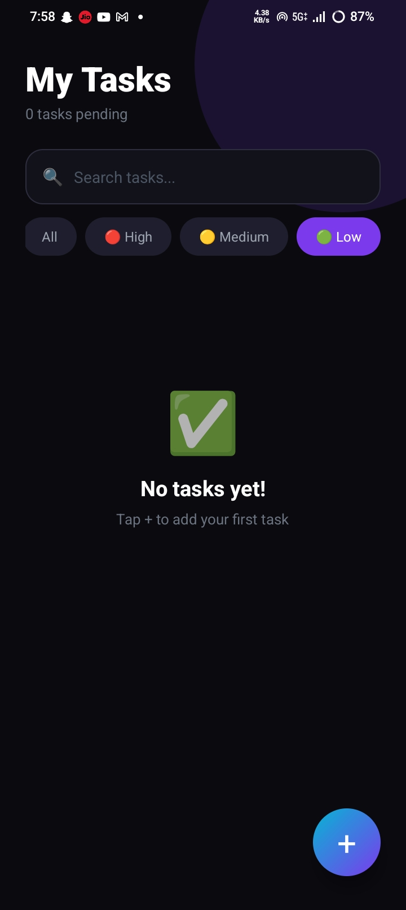
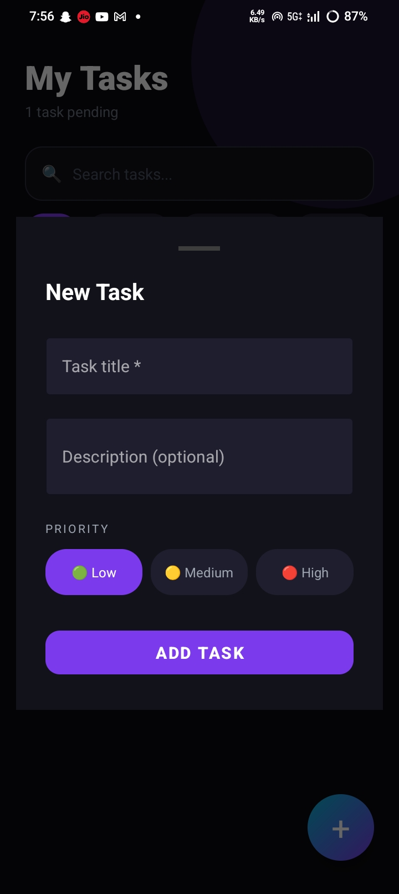
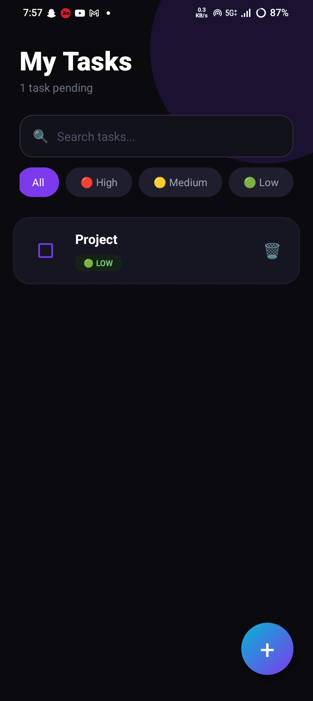
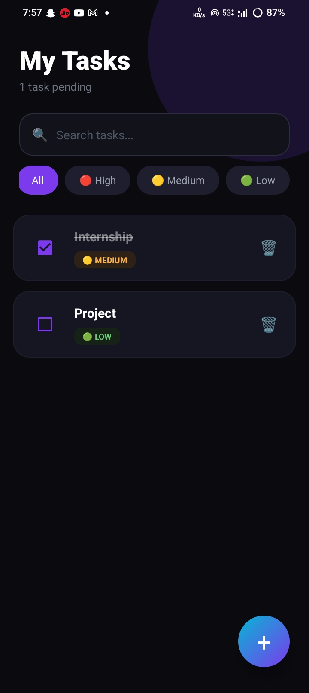

# ✅ To-Do List App - Android

A clean and simple **To-Do List** Android application to help users manage daily tasks efficiently. The app supports adding, editing, deleting, and marking tasks as complete.

## 📱 Screenshots

| Main Screen | Add Task | Edit Task |
|------------|----------|-----------|
|  |  |  |

| Delete Confirmation | Task Completed | Empty State |
|---------------------|----------------|--------------|
|  |  |  |

## ✨ Features

- ➕ Add new tasks with title and description
- ✏️ Edit existing tasks
- ✅ Mark tasks as complete/incomplete
- 🗑️ Delete tasks with confirmation
- 💾 Persistent storage (tasks remain after app restart)
- 🎨 Clean Material Design UI
- 📋 Simple and intuitive interface

## 🛠️ Tech Stack

- **Language:** Java / Kotlin
- **Minimum SDK:** API 21 (Android 5.0)
- **Target SDK:** API 33 (Android 13)
- **Database:** SQLite / Room Database
- **Architecture:** MVVM / MVC

## 🚀 Getting Started

### Prerequisites

- Android Studio (Latest version)
- Android SDK API 21+
- JDK 11 or higher

### Step 3: Get Debug APK (Quick Method)

For quick testing without signing:
1. **Build** → **Build Bundle(s) / APK(s)** → **Build APK(s)**
2. APK location: `app/build/outputs/apk/debug/app-debug.apk`

## 📥 Installation Instructions

1. Copy the `.apk` file to your Android device
2. Go to **Settings** → **Security** → Enable **"Unknown Sources"**
3. Open the APK file using any file manager
4. Tap **Install** → **Open**

## 📥 Download APK

🔗 **[Download To-Do List App APK](https://github.com/Chaithanya8861/todo-list-app/releases/download/v1.0/app-debug.apk)**

## 🤝 Contributing

Contributions are welcome! Feel free to submit pull requests or report issues.

## 📄 License

This project is licensed under the MIT License - see the [LICENSE](LICENSE) file for details.

### ⭐ Star this project if you find it useful!
